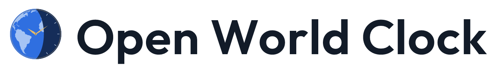
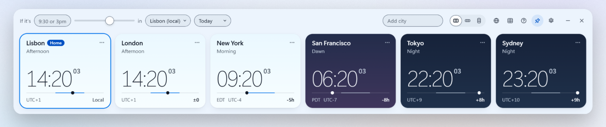
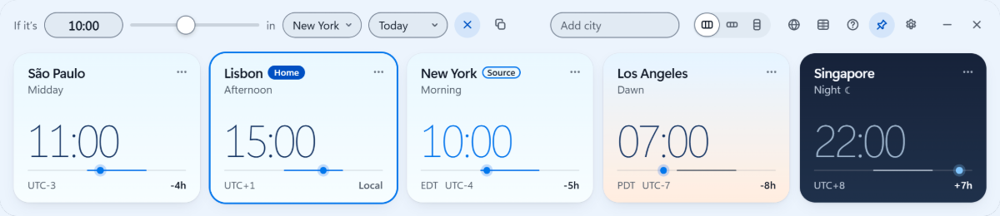
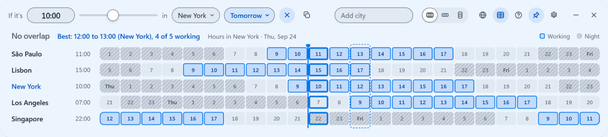
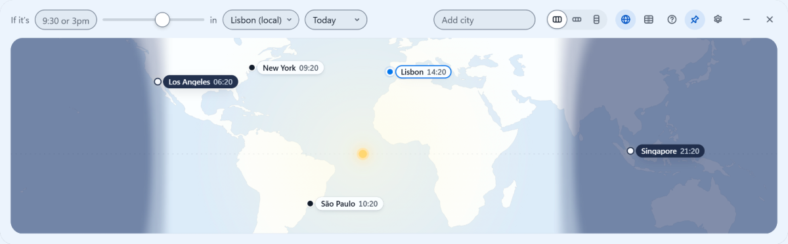

<div align="center">

<picture>
  <source media="(prefers-color-scheme: dark)" srcset="docs/readme/logo-lockup-dark.png">
  
</picture>

<p>The best world clock for Windows. Completely free, no strings attached.</p>

<p>
<a href="https://apps.microsoft.com/detail/9N88FR8M81BM?cid=github-readme"></a>
</p>

<p><a href="https://openworldclock.com/">Try it in your browser</a>, right on the home page, nothing to install.</p>

<p>


<a href="LICENSE"></a>
</p>

</div>

<br>

<picture>
  <source media="(prefers-color-scheme: dark)" srcset="docs/readme/app-dark.png">
  
</picture>

<table>
<tr><td>
<b>Convert</b>: type 10:00 in New York and every card converts, with a moon on the cities between 22:00 and 07:00.<br>
<picture>
  <source media="(prefers-color-scheme: dark)" srcset="docs/readme/converter-dark.png">
  
</picture>
</td></tr>
<tr><td>
<b>Plan</b>: a 24-hour row per city with its working hours, and the best hours when no time works for everyone.<br>
<picture>
  <source media="(prefers-color-scheme: dark)" srcset="docs/readme/planner-dark.png">
  
</picture>
</td></tr>
<tr><td>
<b>Map</b>: day and night as it happens, with a pin for each city.<br>
<picture>
  <source media="(prefers-color-scheme: dark)" srcset="docs/readme/map-dark.png">
  
</picture>
</td></tr>
</table>

## What it is

I wanted the best world clock on Windows and couldn't find it, so I'm building it and giving it away.

Open World Clock sits on your desktop and shows the time in every city you care about. Each card turns light or dark with that city's real sunrise and sunset, so you can tell at a glance who is awake. Scrub the mouse wheel to convert any time across every city, find the hours your team overlaps in the meeting planner, or watch day and night move across the world map.

It is completely free, with no strings attached. You should not have to pay for good software like this. No ads, no account, no telemetry, no data collection, no upsell. It works offline, and the code is open source under the MIT license, so anyone can read it. Software like it should be.

## Download

- **Microsoft Store (recommended):** [Open World Clock on the Microsoft Store](https://apps.microsoft.com/detail/9N88FR8M81BM?cid=github-readme). One click to install, signed by Microsoft, runs natively on x64 and ARM64, and keeps itself updated.
- **winget:** `winget install 9N88FR8M81BM -s msstore`, the same Store build from the command line.
- **Installer:** [Open-World-Clock-1.3.0-setup.exe](https://download.openworldclock.com/Open-World-Clock-1.3.0-setup.exe), per user, no admin rights.
- **Portable exe:** [Open-World-Clock-1.3.0-portable.exe](https://download.openworldclock.com/Open-World-Clock-1.3.0-portable.exe), runs from any folder and never updates itself.
- **In your browser:** the same app runs right on the home page, [openworldclock.com](https://openworldclock.com/), with nothing to install; see [Web app](#web-app) below.

The installer and the portable exe come straight from openworldclock.com; their SHA-256 checksums are on the [download page](https://openworldclock.com/download).

The installer and portable exe are not code-signed yet, so SmartScreen may show "Windows protected your PC" the first time. Click More info, then Run anyway.

**System requirements:** Windows 10 or 11. The Microsoft Store build runs natively on x64 and ARM64. The installer and the portable exe are x64 only. Nothing else to install.

## What it does

**Clocks**

- One card per city, for any IANA time zone, with its UTC offset and the difference from your local time.
- Day and night follow each city's real sunrise and sunset, worked out offline from its coordinates. Hover a card for the times.
- Phase labels through the day: Night, Dawn, Morning, Midday, Afternoon, Golden, Dusk.
- A short note before clocks change for daylight saving ("Clocks +1h tomorrow").
- Search by city, country, abbreviation (EST) or offset (UTC-5, +3). Accents are optional.
- Rename any card, so a Los Angeles clock can say "San Francisco".
- 12 or 24 hour time (the first run follows your Windows region format), seconds optional.

**Converting and planning**

- Type a time like 9, 9:30, 930 or 3pm, pick a city, and every card converts, with +1 day and -1 day markers.
- Or scrub: turn the mouse wheel over any card, or drag along its day line, in 15-minute steps. Back to now resets it. With more cards than fit, the wheel scrolls to the hidden ones, and a card's time and day line still scrub.
- While converting, cities between 22:00 and 07:00 dim and get a moon.
- Date shortcuts: Today, Tomorrow or a weekday.
- Copy the converted times as text for a chat or an invite.
- Meeting planner: a 24-hour row per city, working hours and days set per city, and the shared window labeled ("3 h overlap"). When no hour works for everyone, it points to the hours when the most cities are at work.
- World map with live day and night and a pin for each city.

**Window**

- Frameless and translucent, with adjustable background opacity. Pin it above everything or let it sit behind.
- Three layouts: strip, compact and vertical. Each view remembers its own size.
- On Windows 11, Snap and the native acrylic backdrop.
- Launch at login, and it opens where you left it, on any monitor.

**Tray**

- Closing the window (the X button, Alt+F4 or the taskbar) keeps the clock running in the tray. The first time, a Windows notification says so.
- Click the tray icon to show or hide the window. Right-click it for Pin above all windows, Launch at login, Reset position, Support on Ko-fi and Quit.
- Only Quit in the tray menu, or Windows shutting down, ends the app. Starting it again while it runs brings the window back.
- In the Microsoft Store build, launch at login is switched in Windows Settings > Apps > Startup, and the tray menu points there instead of showing a checkbox. The Store build has no Ko-fi item.

**Settings and languages**

- Light, dark or follow Windows.
- English, Portuguese and Spanish, picked from your Windows display language or set by hand.
- Animations switch off when Windows animation effects are off.

**Keyboard and accessibility**

- Everything works from the keyboard. On a card: Enter converts from that city, `[` and `]` scrub 15 minutes, Page Up and Page Down scrub an hour, Alt+arrows move it, F2 renames, Delete removes, Shift+F10 opens its menu.
- Conversions and changes are announced to screen readers, controls are labeled, and keyboard focus has a visible ring.
- Zoom from 100% to 200% with Ctrl + and Ctrl -, or Ctrl and the mouse wheel; Ctrl 0 goes back to 100%. The window grows with the zoom, and the app remembers it.
- Windows contrast themes keep focus, toggles, sliders and planner hours visible.

## Web app

The same app runs right on the home page, [openworldclock.com](https://openworldclock.com/): the cards, converter, planner, map, search, keyboard shortcuts, themes and languages. It is not a separate version. [scripts/build-web.mjs](scripts/build-web.mjs) builds it into `site/app/` from the Windows app's own renderer (`src/renderer/`) plus a thin browser layer in [web/](web/), so a change to the app reaches the web on the next build. `site/app/` is what the home page shows in its frame; it is not a page of its own.

Cities and settings stay in your browser's local storage. Window features such as pinning, the tray, launch at login and background opacity are left out. Share copies a link to your cities and the time you are converting; everything is in the part of the link after `#`, which browsers never send to a server.

## Privacy

The app collects nothing and sends nothing. Your cities and settings stay in a settings file, with a backup next to it, in your Windows profile: `%APPDATA%\Open World Clock` for the installer and the portable exe, and the app's own package folder for the Microsoft Store build. They never leave your PC. The web app keeps them in your browser instead. The website, web app included, counts page views with cookieless analytics; the details are in [PRIVACY.md](PRIVACY.md).

## Building from source

You need Windows, Node 24 and npm.

```
npm install
npm start
```

`npm test` runs two suites:

1. `test/deep.js` inside the real Electron window: boot state, half-hour and 45-minute offsets, conversions across both DST edges and the year boundary, menus, search, keyboard, hostile settings values, themes, persistence and the security hardening. It uses a throwaway settings folder and its own single-instance lock, so your own settings are never touched and `npm test` and `npm run shots` can run while the installed app is open. If the test app fails to start, its stderr is kept in `test/deep-stderr.log`.
2. Node's test runner over `test/unit/`: time math, sunrise and sunset, the map, color contrast, launch at login, the first-run 12 or 24 hour choice, the backoff that reloads a crashed window, the check that only the app's own page can use the IPC bridge, and the website's analytics proxy.

The web app has its own tests in `test/web/`. Two checks catch generated files that fell behind their sources: `node scripts/build-web.mjs --check` for `site/app/`, and `node scripts/build-icons.mjs --check` for every icon, tile and logo image made from the masters in `build/logo/` (it needs `npm install` in `build/icons-tools` once).

Packaging writes to `dist/`:

| Command | Produces |
| --- | --- |
| `npm run dist` | `Open-World-Clock-x.y.z-setup.exe` and `Open-World-Clock-x.y.z-portable.exe` |
| `npm run dist:store` | `Open-World-Clock-x.y.z-x64.appx` and `Open-World-Clock-x.y.z-arm64.appx` for the Microsoft Store (unsigned; the Store signs them) |
| `npm run dist:all` | All four files in one run |

The setup and portable exes are x64 only; the Store packages cover x64 and ARM64.

After packaging, `node scripts/smoke-packaged.mjs` starts a copy of `dist/win-unpacked` with a throwaway profile and checks that the window really loaded. `npm test` runs the unpackaged app, so it cannot catch a problem that only exists in a packaged build.

Releases can also be built by [.github/workflows/release.yml](.github/workflows/release.yml) when a version tag is pushed: it builds the installer and portable exe, runs the same smoke test and attaches them to a draft release with a provenance attestation.

The app has update code for the installer build, but it is off. Installer builds do not contain `electron-updater` (it is a devDependency, and the app skips the check when the module is missing), and `build.extraMetadata.wcUpdates` is `false` in `package.json`. Turning updates on means code-signing the builds, setting `wcUpdates` to `true` and moving `electron-updater` back to `dependencies`. Until then, updating means downloading the new version.

## Project layout

```
src/          the Electron app: main process, preload bridge, renderer (UI, time math, sun, zones, strings)
test/         in-app Electron suite and Node unit tests
site/         the static website at openworldclock.com; site/app/ is the web app on the home page, generated by scripts/build-web.mjs
web/          the browser layer of the web app (settings in localStorage, shared links)
cloudflare/   Cloudflare Pages config and the website's analytics proxy
apple/        iPhone app and widgets, in progress
shared/       data exported from the JavaScript for the iPhone app, including the reference test vectors
scripts/      packaging hook (Electron fuses), packaged-build smoke test, web app and icon builds, shared data exporters, performance tools (scripts/perf)
build/        logo masters (build/logo) and the app icons and Store tiles that scripts/build-icons.mjs makes from them
```

[CHANGELOG.md](CHANGELOG.md) covers what changed in each version.

## iPhone

An iPhone version is in progress under [apple/](apple/): a native SwiftUI app with Home Screen, Lock Screen and StandBy widgets. The core logic is a Swift package tested against the same reference data (`shared/golden.json`) that is generated from the Windows app's own code, so both apps compute the same times, sunsets and overlaps. Building the app needs a Mac with Xcode.

## Contributing

Bug reports, ideas and translation fixes are welcome as [issues](https://github.com/joaoCarvalho1000/open-world-clock/issues); see [CONTRIBUTING.md](CONTRIBUTING.md). For security issues, see [SECURITY.md](SECURITY.md).

## Support

If it saves you some time zone math, you can [buy me a coffee on Ko-fi](https://ko-fi.com/joaothecarvalho).

## License and credits

MIT, copyright 2026 João Carvalho. See [LICENSE](LICENSE).

- [Electron](https://www.electronjs.org/) runs the Windows app.
- The sunrise and sunset math is derived from [SunCalc](https://github.com/mourner/suncalc) by Volodymyr Agafonkin (BSD 2-Clause).
- Map land outlines come from [Natural Earth](https://www.naturalearthdata.com/) (public domain), by way of [world-atlas](https://github.com/topojson/world-atlas).
- Localized country names come from [Unicode CLDR](https://cldr.unicode.org/).
- The website uses the [Outfit](https://fonts.google.com/specimen/Outfit) font under the SIL Open Font License ([site/assets/fonts/OFL.txt](site/assets/fonts/OFL.txt)).

The license texts for all of these are in [THIRD_PARTY_NOTICES.md](THIRD_PARTY_NOTICES.md).
